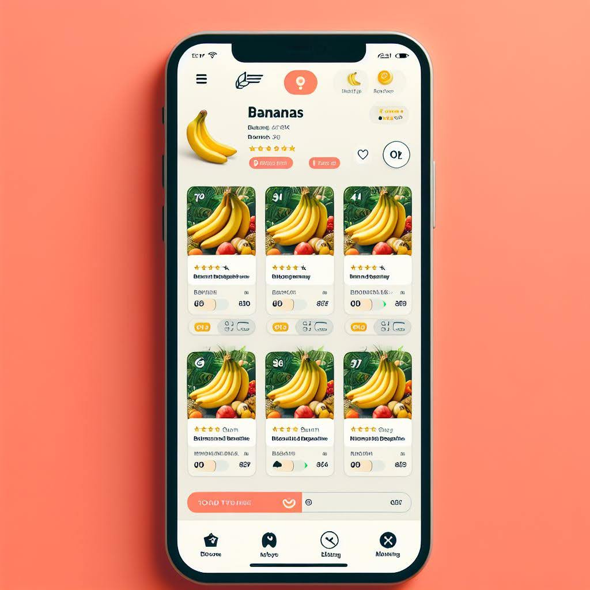
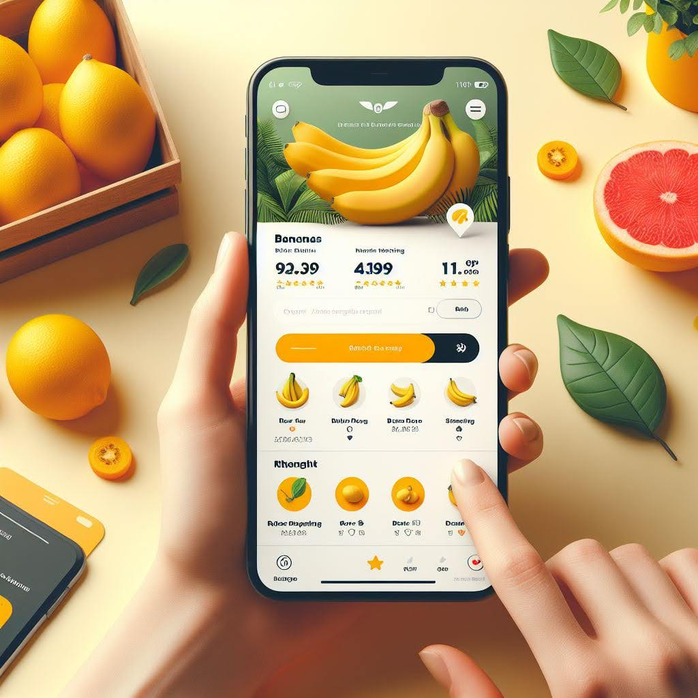

# Going Bananas with Statistics: A Tale of Two App Versions

This is a small A/B testing study conducted as part of the CSCI 535 Multimodal Probabilistic Learning of Human Communication class. The goal of the study was to evaluate two different design layouts for a banana-selling mobile app and determine which one is easier to navigate.

## Background

As part of a class practicum, we were tasked with operationalizing a measure, building a Google Form for assessment, and running an A/B testing study with peers. The specific task was to create two app design layouts using generative AI (Bing Create) and conduct A/B testing with a questionnaire to find which layout is easier to navigate.

## Methodology

1. **Design Layouts**: We used Bing Create, a generative AI tool, to create two different design layouts for a banana-selling mobile app. These layouts were named Group A and Group B.

<table>
  <tr>
    <th>Group A</th>
    <th>Group B</th>
  </tr>
  <tr>
    <td>   </td>
    <td>  </td>
  </tr>
</table>

2. **Questionnaire**: A questionnaire was developed to assess the navigation experience and appeal of each layout. The questionnaire consisted of the following questions:

   - Q1: On a scale of 1-5, how motivated are you to make a purchase based on this app layout? (5 = very likely to purchase, 1 = very unlikely to purchase)
   - Q2: How easy was it to find the banana you were looking for? (5 = very easy, 1 = very difficult)
   - Q3: On a scale of 1-5, how clear did you find the labels and icons in the app layout? (5 = very clear, 1 = very confusing)
   - Q4: On a scale of 1-5, how appealing or unappealing do you find the app layout? (5 = very appealing, 1 = very unappealing)

3. **Google Form**: A Google Form was created to collect responses from participants. The form included the questionnaire and allowed participants to view and interact with the two app layouts (Group A and Group B).

4. **A/B Testing**: The Google Form was shared with peers, who were randomly assigned to either Group A or Group B. Participants interacted with the assigned app layout and provided their responses to the questionnaire.

5. **Data Analysis**: The collected responses were analyzed using statistical methods. The mean scores for each question and the overall mean scores for Group A and Group B were calculated.

## Results

The results of the A/B testing study are as follows:

- Group A mean score (across all four questions): 3.076
- Group B mean score (across all four questions): 3.727
- p-value for the difference in mean scores: 0.029

The p-value of 0.029 indicates a statistically significant difference between the mean scores of Group A and Group B. Based on these results, we can reject the null hypothesis of equal means for the two groups.

The higher mean score for Group B suggests that the app layout in Group B was perceived as easier to navigate and more appealing compared to the layout in Group A.
